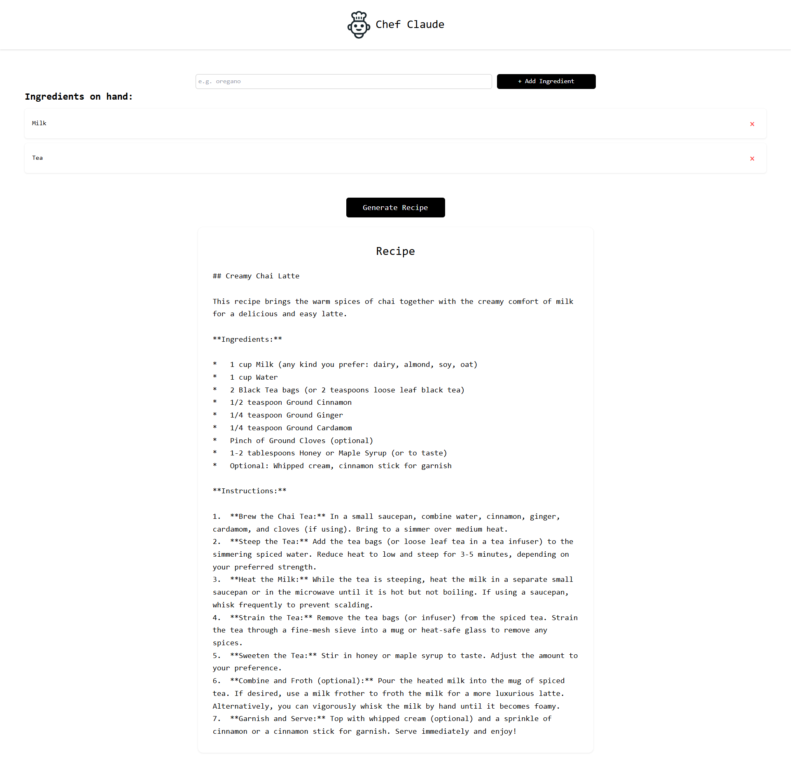

# Chef Claude Recipe Generator


A React + FastAPI application that generates recipes based on ingredients you have on hand, powered by Google's Gemini AI.

## Usage

1. Add ingredients using the input field [can also remove clicking red x]
2. Click the "Generate Recipe" button
3. View your AI-generated recipe with ingredients and instructions

## Demo



## Tech Stack

- Frontend: React
- Backend: FastAPI
- AI: Google Gemini API
- Styling: CSS

## Setup

### 1. Clone the repository

```bash
git clone <repository-url>
cd chef-claude
```

### 2. Frontend Setup

```bash
npm install
```

### 3. Backend Setup

Create and activate a virtual environment:

```bash
python -m venv .venv
.venv\Scripts\activate  # Windows
```

Install dependencies:

```bash
pip install -r "requirements.txt"
```

### 4. Environment Configuration

Create a `.env` file in the project root:

```plaintext
GOOGLE_API_KEY=your_gemini_api_key_here
```

## Running the Application

1. Start the backend server:

```bash
cd src
uvicorn backend:app --reload
```

2. In a new terminal, start the frontend:

```bash
npm run dev
```

3. Open your browser and navigate to:

```
http://localhost:5173
```
